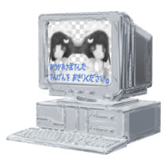
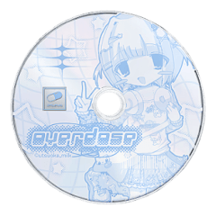
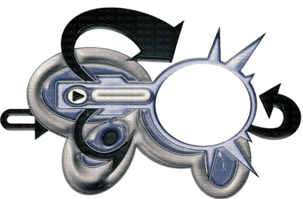

<p align="center"></p>

<h1 align="center">Fernando Yeoshua</h1>

<p align="center">
  
</p>

<p align="center">
  
  
  
  
</p>

<p align="center">
  
  &nbsp;&nbsp;
  
  &nbsp;&nbsp;
  
</p>

---

<p align="center">Independent pentester pushing into exploit development.<br/>
I build offensive tools I actually use in the field — network recon, OSINT, domain discovery.<br/>
<code>memory corruption · ROP chains · binary analysis · shellcode</code></p>

---

### `// focus`

| | Area | Details |
|---|---|---|
| `[*]` | **Offensive Security** | network recon · web exploitation · OSINT |
| `[*]` | **Exploit Development** | binary analysis · memory corruption · shellcoding |
| `[ ]` | **Next** | heap exploitation · kernel exploitation |

---

### `// stack`

<p align="center"><b>Systems &amp; Low-level</b></p>
<p align="center">
  
  
  
  
</p>

<p align="center"><b>Scripting &amp; Backend</b></p>
<p align="center">
  
  
  
  
</p>

<p align="center"><b>Web &amp; Data</b></p>
<p align="center">
  
  
  
  
</p>

---

### `// projects`

<table align="center" width="90%">
  <tr>
    <td align="center" width="50%">
      <a href="https://github.com/YoshiBigSmoke/sniky-cho">
        
      </a><br/><br/>
      Silent network recon TUI<br/><sub>passive + semi-passive · leaves no trace</sub><br/><br/>
      
      
    </td>
    <td align="center" width="50%">
      <a href="https://github.com/YoshiBigSmoke/webexplorer">
        
      </a><br/><br/>
      Domain discovery via CT Logs + Wayback<br/><sub>parallel sources · SQLite cache</sub><br/><br/>
      
      
    </td>
  </tr>
  <tr>
    <td align="center" width="50%"><br/>
      <a href="https://github.com/YoshiBigSmoke/NetMapper">
        
      </a><br/><br/>
      Bash network scanner built on Nmap<br/><sub>host discovery · target selection · fast recon</sub><br/><br/>
      
    </td>
    <td align="center" width="50%"><br/>
      <a href="https://github.com/YoshiBigSmoke/financial-analyzer">
        
      </a><br/><br/>
      Desktop financial analysis app<br/><sub>DCF · ARIMA · Monte Carlo · GARCH</sub><br/><br/>
      
      
      
    </td>
  </tr>
  <tr>
    <td align="center" width="50%"><br/>
      <a href="https://github.com/YoshiBigSmoke/NettMappel">
        
      </a><br/><br/>
      Web-based network scanning platform<br/><sub>Flask · React · Nmap · JSON · scan history</sub><br/><br/>
      
      
    </td>
    <td align="center" width="50%"><br/>
      <a href="https://github.com/YoshiBigSmoke/evil-portal-html">
        
      </a><br/><br/>
      Evil Portal pages for Flipper Zero<br/><sub>credential capture · educational · HTML</sub><br/><br/>
      
    </td>
  </tr>
</table>

---

### `// currently`

```python
status = {
    "studying" : ["heap exploitation", "ROP chains", "format string bugs"],
    "building" : ["recon tooling for independent engagements"],
    "goal"     : "structured exploit dev workflow on Linux",
}
```

<p align="center">
  
  
  
  
  
  
  
</p>

<p align="center">
  
  
  
</p>
